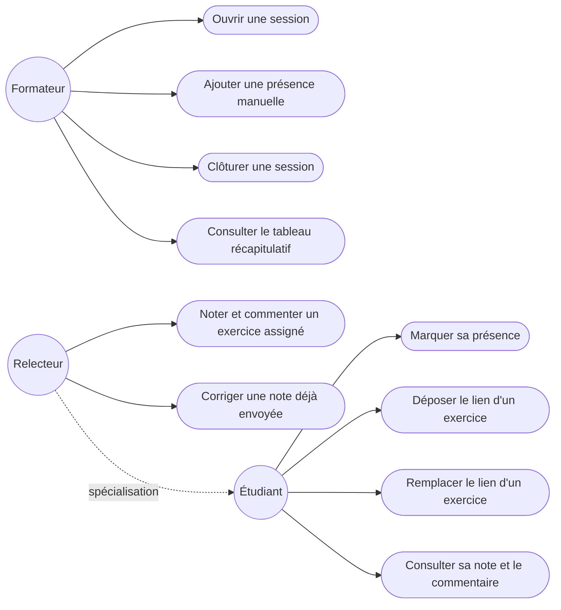

# D1 — Cas d'utilisation

```mermaid
flowchart LR
    Formateur((Formateur))
    Etudiant((Étudiant))
    Relecteur((Relecteur))

    Formateur --> UC1([Ouvrir une session])
    Formateur --> UC2([Ajouter une présence manuelle])
    Formateur --> UC3([Clôturer une session])
    Formateur --> UC4([Consulter le tableau récapitulatif])

    Etudiant --> UC5([Marquer sa présence])
    Etudiant --> UC6([Déposer le lien d'un exercice])
    Etudiant --> UC7([Remplacer le lien d'un exercice])
    Etudiant --> UC8([Consulter sa note et le commentaire])

    Relecteur --> UC9([Noter et commenter un exercice assigné])
    Relecteur --> UC10([Corriger une note déjà envoyée])

    Relecteur -.spécialisation.-> Etudiant
```