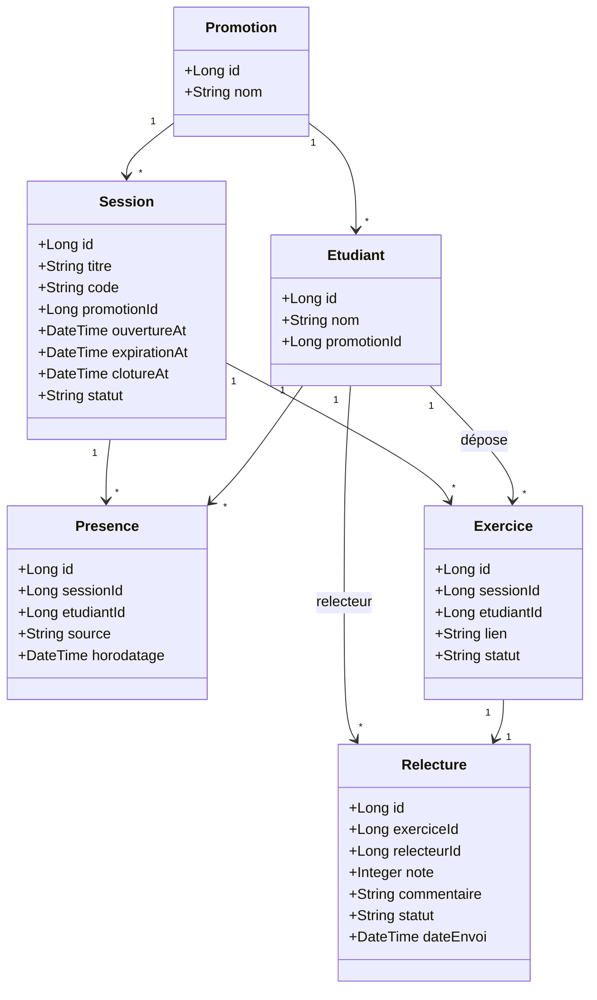

# D2 — Classes / modèle de données

```mermaid
classDiagram
    class Promotion {
        +Long id
        +String nom
    }
    class Etudiant {
        +Long id
        +String nom
        +Long promotionId
    }
    class Session {
        +Long id
        +String titre
        +String code
        +Long promotionId
        +DateTime ouvertureAt
        +DateTime expirationAt
        +DateTime clotureAt
        +String statut
    }
    class Presence {
        +Long id
        +Long sessionId
        +Long etudiantId
        +String source
        +DateTime horodatage
    }
    class Exercice {
        +Long id
        +Long sessionId
        +Long etudiantId
        +String lien
        +String statut
    }
    class Relecture {
        +Long id
        +Long exerciceId
        +Long relecteurId
        +Integer note
        +String commentaire
        +String statut
        +DateTime dateEnvoi
    }

    Promotion "1" --> "*" Etudiant
    Promotion "1" --> "*" Session
    Session "1" --> "*" Presence
    Session "1" --> "*" Exercice
    Etudiant "1" --> "*" Presence
    Etudiant "1" --> "*" Exercice : dépose
    Etudiant "1" --> "*" Relecture : relecteur
    Exercice "1" --> "1" Relecture
```