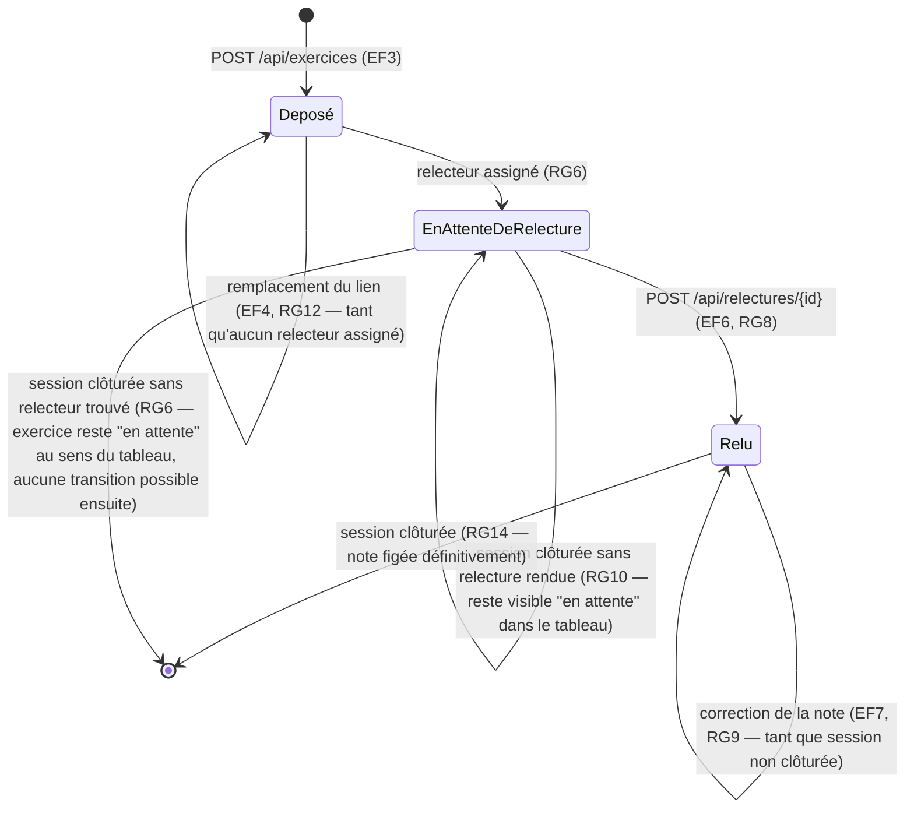

# D4 — États-transitions : cycle de vie d'un exercice

```mermaid
stateDiagram-v2
    [*] --> Deposé : POST /api/exercices (EF3)

    Deposé --> Deposé : remplacement du lien (EF4, RG12 — tant qu'aucun relecteur assigné)
    Deposé --> EnAttenteDeRelecture : relecteur assigné (RG6)

    EnAttenteDeRelecture --> Relu : POST /api/relectures/{id} (EF6, RG8)
    EnAttenteDeRelecture --> EnAttenteDeRelecture : session clôturée sans relecture rendue (RG10 — reste visible "en attente" dans le tableau)

    Relu --> Relu : correction de la note (EF7, RG9 — tant que session non clôturée)
    Relu --> [*] : session clôturée (RG14 — note figée définitivement)
    EnAttenteDeRelecture --> [*] : session clôturée sans relecteur trouvé (RG6 — exercice reste "en attente" au sens du tableau, aucune transition possible ensuite)
```